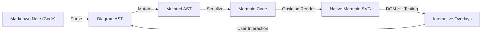

# Obsidian Visual Mermaid — Architecture & Agent Guide

This document provides a comprehensive technical overview of the architecture of **Visual Mermaid Studio (`obsidian-visual-mermaid`)**. It is designed specifically to help human contributors and AI coding assistants understand the system's principles, component responsibilities, file organization, and extension patterns.

---

## 1. Core Architecture Philosophy

Mermaid is a declarative, code-first diagramming language. It calculates layout automatically using graph layout algorithms (dagre, elk, or d3). Traditional visual editors attempt to impose absolute pixel coordinates onto diagrams, causing layout conflicts, syntax degradation, and synchronization nightmares.

**Visual Mermaid Studio** adopts a **structural, non-spatial architecture**:
1. **Source of Truth**: The Mermaid syntax string in the Markdown document is always the single source of truth.
2. **Pure AST Operations**: User actions (click, sprout, drag-to-connect, delete) mutate an in-memory Abstract Syntax Tree (AST), which serializes back to standard Mermaid code.
3. **100% Native Obsidian Rendering**: The code is passed directly to Obsidian's native Mermaid renderer. No custom layout engines or canvas libraries (React Flow, Elk) are used.
4. **Interactive Direct-Manipulation Overlays**: Lightweight SVG/HTML overlays (selection halos, sprout buttons, drag-to-connect lines, floating HUDs, and inline text inputs) track the bounding boxes of rendered SVG elements without interfering with diagram layout.
5. **Camera Stabilization**: Viewport tracking pins active nodes across re-renders to eliminate jarring view jumps.



---

## 2. Directory Structure & Module Map

The codebase is organized into modular single-responsibility units:

```
src/
├── main.ts                     # Obsidian Plugin lifecycle entrypoint (clean, lightweight coordinator)
├── ast/                        # Flowchart AST parser, serializer, and mutations
│   ├── types.ts                # AST definitions (nodes, edges, styles, subgraphs)
│   ├── lexer.ts                # Tokenizer for flowchart syntax
│   ├── parser.ts               # Recursive descent flowchart parser
│   ├── styleParser.ts          # Style declarations, classDef resolution, and arrow mapping
│   ├── serializer.ts           # AST-to-Mermaid code emission
│   ├── mutations.ts            # Facade re-exporting modular mutation functions
│   └── mutations/              # Granular AST mutation modules (<300 LOC each)
│       ├── nodeMutations.ts    # Add, sprout, morph shape, delete nodes
│       ├── edgeMutations.ts    # Connect, reverse, relabel, split edge
│       ├── styleMutations.ts   # Node, edge, and subgraph theme/color styles
│       ├── subgraphMutations.ts# Group, ungroup, move, dissolve subgraphs
│       ├── clipboardMutations.ts # Duplicate, copy, paste nodes/edges
│       └── index.ts            # Barrel export
├── diagrams/                   # Multi-diagram driver system
│   ├── types.ts                # DiagramDriver interface & diagram detection types
│   ├── registry.ts             # Registered diagram types (flowchart, stateDiagram)
│   ├── flowchart/              # Flowchart driver implementation
│   └── state/                  # State diagram implementation
│       ├── types.ts            # State AST definitions
│       ├── lexer.ts            # State diagram tokenizer
│       ├── parser.ts           # State diagram parser
│       ├── serializer.ts       # State diagram serializer
│       ├── stateDriver.ts      # DiagramDriver implementation for State
│       ├── mutations.ts        # Facade re-exporting state mutations
│       └── mutations/          # Modular state mutations (<250 LOC each)
│           ├── stateMutations.ts       # Add, label, delete, start/end states
│           ├── transitionMutations.ts  # State transitions & edge connections
│           ├── compositeMutations.ts   # Nested composite states & grouping
│           ├── styleMutations.ts       # State & transition styling
│           ├── clipboardMutations.ts   # Duplicate state subtrees
│           └── index.ts                # Barrel export
├── obsidian/                   # Obsidian API adapters (decoupled from UI)
│   ├── buttonInjector.ts       # Injects "Visual Mode" button beside Obsidian's edit button
│   ├── workspaceObserver.ts    # Monitors workspace leaves, preview mutations, and active file
│   └── diagramOpener.ts        # Coordinates opening diagrams in modal or file tabs
├── canvas/                     # Interactive visual canvas & overlays
│   ├── NativeMermaidView.tsx   # Primary React canvas coordinator component
│   ├── types.ts                # Viewport, camera, selection, and overlay types
│   ├── constants.ts            # Preset color themes, edge styles, shapes
│   ├── useHistory.ts           # Undo/redo stack hook
│   ├── historyManager.ts       # Core history data structure
│   ├── components/             # Reusable canvas UI components
│   │   ├── CanvasTopBar.tsx    # Direction toggle, cursor mode, add step, undo/redo
│   │   ├── CanvasOverlays.tsx  # Composed overlay container delegating to overlay layers
│   │   ├── NodeActionHud.tsx   # Sprout, shape, color, delete floating HUD
│   │   ├── EdgeActionHud.tsx   # Edge type, reverse, label, delete HUD
│   │   ├── SubgraphActionHud.tsx # Subgraph rename, style, dissolve HUD
│   │   ├── MultiSelectHud.tsx  # Multi-element batch action HUD
│   │   └── SyntaxDrawer.tsx    # Slide-out live Mermaid code drawer
│   ├── overlays/               # Focused overlay rendering layers (<180 LOC each)
│   │   ├── NodeOverlays.tsx    # Selected node halo, sprout button, popovers
│   │   ├── EdgeOverlays.tsx    # Edge selection halo and action HUD
│   │   ├── SubgraphOverlays.tsx# Subgraph cluster selection, borders, actions
│   │   ├── MultiSelectOverlays.tsx # Multi-selection bounding box & batch actions
│   │   └── InlineEditOverlays.tsx  # Direct text editing inputs for nodes/edges/subgraphs
│   ├── interaction/            # SVG DOM hit-testing & event setup
│   │   ├── setupSvgInteractivity.ts # Orchestrator for SVG DOM listeners
│   │   ├── nodeInteractivity.ts     # Node selection, hover, [*] anchors
│   │   ├── edgeInteractivity.ts     # Edge hit-testing and hovering
│   │   └── clusterInteractivity.ts  # Subgraph cluster selection & dblclick
│   ├── renderer/               # SVG rendering & selection styling
│   │   ├── mermaidRenderer.ts  # Obsidian native mermaid.render wrapper
│   │   └── selectionHalo.ts    # SVG halo styling for active nodes and edges
│   └── hooks/                  # Granular canvas state hooks
│       ├── useCanvasCamera.ts  # Pan, zoom, wheel, fit-view, pinNodeForCamera
│       ├── useCanvasSelection.ts # Selection state (single, multi, subgraphs)
│       ├── useMarqueeSelection.ts # Drag-to-select box calculation
│       ├── useInlineEditing.ts # Inline text edit state and commit handlers
│       ├── useCanvasShortcuts.ts # Keyboard shortcuts (Del, Ctrl+Z, Ctrl+C/V, Space)
│       ├── useCanvasMouseInteractions.ts # Pan, drag-to-connect line, hover tracking
│       ├── useCanvasRenderer.ts# SVG rendering effect, camera stabilization, unmatched subgraphs
│       ├── useDiagramMutations.ts # Composed diagram mutation coordinator
│       └── mutations/          # Modular mutation sub-hooks (<300 LOC each)
│           ├── useDiagramAst.ts        # AST caching, validation, error state
│           ├── useNodeMutations.ts     # Sprouting, shape morphing, node deletion
│           ├── useEdgeMutations.ts     # Connecting, edge reversal, edge deletion
│           ├── useSubgraphMutations.ts # Subgraph creation, renaming, dissolve
│           ├── useBatchMutations.ts    # Multi-node batch operations
│           └── useClipboardMutations.ts# Copy, paste, duplicate
└── utils/                      # Helper algorithms
    ├── markdownBlock.ts        # Scans and updates ```mermaid fences in markdown notes
    ├── edgeMatching.ts         # Fuzzy maps SVG <path> elements to AST edge definitions
    └── edgeGeometry.ts         # Math for SVG bezier path hit distance
```

---

## 3. Engineering Rules for AI & Developers

### 1. The 300 LOC Guideline
- Keep every file **under 300 lines of code** whenever feasible.
- Break large components into domain-specific sub-layers (e.g., `NodeOverlays`, `EdgeOverlays`).
- Break large hooks into focused sub-hooks (e.g., `useNodeMutations`, `useEdgeMutations`).
- Always maintain facade re-exports (`index.ts` or the original file name) to preserve backward compatibility with tests and callers.

### 2. Pure AST Mutations
- **NEVER** modify SVG DOM nodes directly to update diagram structure.
- Always apply edits through AST mutation functions (`addNode`, `connectNodes`, `deleteNode`, etc.).
- When modifying the AST, serialize it back to Mermaid code, verify syntax, and update state.

### 3. Camera Stabilization (Prevent Viewport Jumps)
- Whenever a user triggers a structural modification (such as sprouting a new node or splitting an edge), call `pinNodeForCamera(activeNodeId)`.
- The camera will track that node's screen coordinate before and after re-rendering and automatically adjust the pan offset.

### 4. Zero Code Lock-in
- Emitted Mermaid code must be 100% clean, standard Mermaid syntax.
- Do **not** inject synthetic comment coordinates (e.g. `%% mv: x=100,y=200 %%`).

### 5. Multi-Diagram Architecture (Driver Pattern)
- **The `DiagramDriver` interface (`src/diagrams/types.ts`) is the only contract the canvas layer talks to.** The canvas never branches on diagram type — adding a diagram means adding one package and registering its driver.
- A driver provides:
  - `parse` / `serialize` / `createDefault` / `clone` / `createEmpty` — code ⇄ AST round-trip.
  - `project(ast)` — read-only projection onto the shared flowchart-shaped view-model (`MermaidNodeDef` / `MermaidEdgeDef` / `MermaidSubgraphDef`) used by all overlays. **Never edit the projection**; mutations go through `driver.mutations`.
  - `mutations` — the full mutation surface (nodes, connections, styles, groups, duplication, direction). Optional members (e.g. `updateEdgeType`, edge styles) are gated by capabilities.
  - `anchors` (optional) — start/end pseudo-node API (`[*]`).
  - `capabilities` — what the UI offers (`supportsEdgeTypes`, `supportsNodeKinds`, `hasAnchors`, ...). Popovers and HUDs render from capabilities.
  - `labels` — UI vocabulary (`node` = "Step" / "State", ...). Components never hard-code diagram-specific nouns.
  - `dom` — SVG DOM adapter (node id prefixes, anchor selectors, anchor-kind resolution) so hit-testing is per-diagram.
- **Single active AST**: `useDiagramAst` holds one AST owned by the current driver. Mutations clone (`driver.clone`), mutate the clone, then serialize and emit. External code changes (undo/redo, syntax drawer) re-parse through an effect — there are no dual AST states to keep in sync.
- State diagrams have unique syntax requirements:
  - Pseudo-states (`<<choice>>`, `<<fork>>`, `<<join>>`) must not have aliases (`state "label" as id`).
  - Start/end anchors are denoted by `[*]`, share one node id, and cannot be multi-selected or converted to normal states via morphing.
  - Directional transitions to/from `[*]` must be strictly preserved.

---

## 4. Verification & Testing

Always verify changes using both test and build checks:

```bash
# Run all unit and integration tests (116+ passing tests)
npm test

# Run TypeScript type check and production esbuild bundle
npm run build
```

---

## 5. Adding a New Diagram Type

To add support for a new Mermaid diagram type (e.g., Class Diagram, ER Diagram):

1. **Define AST & Types**: In `src/diagrams/<name>/types.ts`.
2. **Implement Lexer & Parser**: In `src/diagrams/<name>/lexer.ts` and `parser.ts`.
3. **Implement Serializer**: In `src/diagrams/<name>/serializer.ts`.
4. **Implement Mutations**: In `src/diagrams/<name>/mutations/`, then wire them into the `DiagramMutations` surface.
5. **Implement Driver**: Implement the full `DiagramDriver<T>` interface in `src/diagrams/<name>/<name>Driver.ts` — including `project`, `capabilities`, `labels`, `nodeKindOptions`, `mutations`, and the `dom` adapter. Unsupported features are simply omitted from `capabilities` (the UI hides them automatically).
6. **Register Driver**: Add to `src/diagrams/registry.ts` and add a `DiagramTemplate` entry.
7. **Verify**: Add unit tests under `tests/<name>.test.ts` (see `tests/driverSurface.test.ts` for the driver-contract test pattern) and ensure `npm test` passes.

**No canvas, hook, overlay, or component files need to change** — if they do, the driver contract has a gap that should be fixed in `src/diagrams/types.ts` instead.
