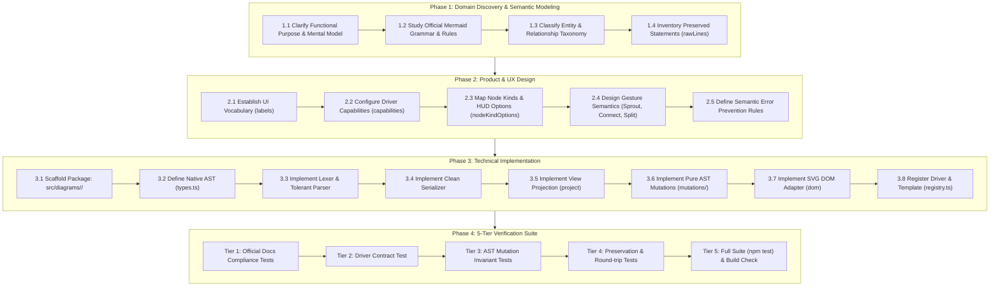

# Mermaid Diagram Expansion Playbook & Architecture Procedure

This document defines the standardized, 5-phase engineering and product procedure for introducing support for any new Mermaid diagram type (e.g. Class, Entity-Relationship, Mindmap, Sequence, Git Graph, Gantt, Timeline, Architecture) into **Visual Mermaid Studio (`obsidian-visual-mermaid`)**.

It is designed to be directly actionable by human developers and autonomous AI coding assistants, guaranteeing zero regressions, strict round-trip syntax fidelity, and UX coherence across the entire app.

---

## Architecture Context & Guarantees

Before initiating the procedure, every contributor or AI assistant must understand the core architectural rules established in [ARCHITECTURE.md](../ARCHITECTURE.md):

1. **Zero Canvas Branching**: The canvas layer ([`NativeMermaidView.tsx`](../src/canvas/NativeMermaidView.tsx), overlays, HUDs, interaction hooks) **never branches on diagram type**. It only interacts with the polymorphic [`DiagramDriver<TAst>`](../src/diagrams/types.ts#L179-L203) interface.
2. **View Projection Isolation**: The canvas consumes a read-only projection ([`ViewProjection`](../src/diagrams/types.ts#L39-L44)) composed of [`MermaidNodeDef`](../src/diagrams/viewModel.ts#L47-L57), [`MermaidEdgeDef`](../src/diagrams/viewModel.ts#L59-L67), and [`MermaidSubgraphDef`](../src/diagrams/viewModel.ts#L69-L77). The canvas never mutates projection objects directly.
3. **Single Active AST**: All mutations happen via pure functions on a cloned AST (`driver.clone(ast)`), which is then serialized and parsed back.
4. **Verbatim Preservation (Zero Code Lock-in)**: Mermaid statements not directly modeled by visual editing tools (YAML frontmatter, comments `%%`, directives `accTitle`, themes, unsupported advanced annotations) must be preserved verbatim in `rawLines` and re-emitted without corruption.
5. **Obsidian Parity**: SVG rendering is performed 100% natively by Obsidian's Mermaid engine. Direct-manipulation overlays match the SVG DOM bounding boxes without modifying layout calculations.



---

## Phase 1: Domain Discovery & Semantic Modeling

### Step 1.1: Clarify Functional Purpose & User Mental Model
Before writing code or designing UI, define what user problem this diagram solves:
- **Diagram Classification**:
  - *Graph-based* (Nodes, Directed/Undirected Edges, Containers): Flowchart, State, Class, Entity-Relationship (ER), Architecture, Block.
  - *Hierarchy/Tree-based* (Root, Branches, Leaves): Mindmap.
  - *Linear / Timeline / Lifeline-based*: Sequence, Git Graph, Gantt, Timeline, User Journey.
  - *Data / Metric-based*: Pie, XYChart, Sankey, Quadrant.
- **Core User Actions**: What is the most frequent user action?
  - In a Flowchart: "Add next step in the workflow" (Sprouting).
  - In a State machine: "Transition to next state" or "Branch to choice/fork".
  - In a Class diagram: "Add related class" (Inherits/Implements/Composes) or "Add attribute/method".
  - In an ER diagram: "Add entity and relate with cardinality (1:N, M:N)".
  - In a Mindmap: "Add sibling topic" or "Add subtopic".

### Step 1.2: Official Mermaid Grammar & Specification Mining
Read the official Mermaid documentation for the target diagram (`https://mermaid.js.org/syntax/<diagram>.html`).
Document:
1. **Header Variants**: What declares this diagram? (e.g., `classDiagram`, `classDiagram-v2`, `erDiagram`, `mindmap`).
2. **Direction Directives**: Does it support `direction TB/LR/RL/BT` at diagram level? Inside containers?
3. **Element Formats**:
   - Explicit declaration vs implicit declaration via edges.
   - Identifier syntax (alphanumeric, dashes, underscores, spaces with quotes or aliases).
   - Descriptive labels / aliases (e.g. `class "Account Service" as AccService` or `s1 : Label`).
4. **Relationship Syntax**:
   - Arrow and line varieties (e.g. `<|--`, `*--`, `o--`, `..|>`, `-->`, `||--o{`).
   - Labels, annotations, cardinalities, or event names on relationships.
5. **Special Elements**:
   - Pseudo-elements (anchors `[*]`, markers, stereotypes `<<interface>>`).
   - Member definitions (attributes, methods, data types, keys PK/FK).
6. **Diagram-specific Constraints**:
   - What connections or structures are invalid in Mermaid? (e.g., connecting states across different composite state regions; invalid relationship tokens).

### Step 1.3: Entity & Relationship Taxonomy
Map the diagram's grammar items into four structural categories:
- **Nodes**: Visual units that have a bounding box, position, label, and shape/kind.
- **Edges**: Connections between two nodes, with an arrow type, stroke style, and optional label.
- **Containers / Groups**: Visual clusters containing child nodes or nested containers (e.g., packages, composite states, subgraphs).
- **Sub-Items / Members**: Internal items embedded inside a node (e.g. class fields/methods, entity attributes).

### Step 1.4: Inventory Preserved Statements (`rawLines`)
Identify all syntax valid in Mermaid that the visual editor will not mutate directly, which **must** be stored and emitted verbatim:
- YAML frontmatter block (`--- ... ---`).
- Mermaid comments (`%% comment`).
- Accessibility directives (`accTitle: ...`, `accDescr { ... }`).
- Diagram configuration directives (`%%{init: {...}}%%`).
- Free-floating notes (e.g. `note "text" as N1`, `note for ClassA "text"`).
- Styling statements (`classDef`, `style`, `cssClass`).

> [!IMPORTANT]
> **The Non-Destructive Golden Rule**: A user must be able to open a complex, hand-crafted Mermaid diagram in visual mode, perform an edit (e.g. rename a node), and switch back to code mode without losing any comments, frontmatter, configuration directives, or unmodeled lines.

---

## Phase 2: Product & UX Design (Coherence, Simplicity, Accuracy)

Visual Mermaid Studio aims for an intuitive, direct-manipulation interface that feels familiar regardless of diagram type, while respecting each diagram's specific rules.

### Step 2.1: UI Vocabulary Adaptation (`DiagramLabels`)
The canvas UI components ([`CanvasTopBar`](../src/canvas/components/CanvasTopBar.tsx), [`NodeActionHud`](../src/canvas/components/NodeActionHud.tsx), [`EdgeActionHud`](../src/canvas/components/EdgeActionHud.tsx)) dynamically render their text from [`driver.labels`](../src/diagrams/types.ts#L62-L73).

Define appropriate terminology:

| Diagram | `node` | `nodes` | `edge` | `edges` | `group` | `addNode` | `addChild` | `insertNodeOnEdge` | `edgeLabelPlaceholder` |
|---|---|---|---|---|---|---|---|---|---|
| **Flowchart** | Step | Steps | Connection | Connections | Group | Add Step | Next Step | Insert Step | Label (e.g. yes/no)... |
| **State** | State | States | Transition | Transitions | Composite | Add State | Next State | Insert State | Event / Condition... |
| **Class** | Class | Classes | Relationship | Relationships | Package | Add Class | Subclass / Relation | Insert Intermediate | Label / Multiplicity... |
| **ER** | Entity | Entities | Relationship | Relationships | Module | Add Entity | Related Entity | Insert Associative | Cardinality / Label... |
| **Mindmap** | Topic | Topics | Branch | Branches | Section | Add Topic | Subtopic | Insert Subtopic | Topic Note... |

### Step 2.2: Capabilities Configuration (`DiagramCapabilities`)
Set the feature flags in [`DiagramCapabilities`](../src/diagrams/types.ts#L47-L59) to show or hide canvas UI elements automatically:

```typescript
export interface DiagramCapabilities {
  supportsDirection: boolean;    // Shows/hides "Flow: LR" direction toggle in TopBar
  supportsNodeKinds: boolean;     // Shows/hides Shape/Kind picker in NodeActionHud
  supportsEdgeTypes: boolean;     // Shows/hides arrow type buttons in EdgeActionHud
  supportsEdgeStyles: boolean;    // Shows/hides edge color/dash picker
  supportsGroups: boolean;        // Shows/hides "Add Group" in TopBar and group picker in HUD
  hasAnchors: boolean;            // Shows/hides +Start / +End buttons in TopBar
}
```

- If `supportsNodeKinds: false`, the shape icon button disappears from the node HUD.
- If `supportsEdgeTypes: false`, the arrow style segment disappears from the edge HUD.
- If `supportsGroups: false`, the group button and assign-to-group popovers disappear.

### Step 2.3: Node Kinds vs Shapes Specification (`nodeKindOptions`)
Define the options presented in the [`KindPopover`](../src/canvas/components/KindPopover.tsx):
- For **Flowchart**: 14 flowchart shapes (rectangle, rounded, diamond, hexagon, cylinder, etc.).
- For **State**: `normal`, `choice`, `fork`, `join`.
- For **Class**: `class`, `interface`, `abstract`, `enum`, `service`.
- For **ER**: `normal`, `identifying`, `associative`.
- For **Mindmap**: `rectangle`, `rounded`, `circle`, `cloud`, `bang`, `hexagon`.

### Step 2.4: Gesture & Direct-Manipulation Semantics
Determine how standard canvas interactions behave:
1. **Sprouting (`addChildNode`)**:
   - When the user clicks `+` (sprout) on an active node, what does it create?
   - Default label for the new child (e.g. `Class 2`, `New State`, `Subtopic`).
   - Default connection type (e.g., standard arrow, inheritance link, or branch).
   - Placement: In direction of layout (right in LR, down in TB).
2. **Drag-to-Connect**:
   - Dragging the connection handle from Node A to Node B creates a default valid relationship between them.
3. **Double-Click Inline Editing**:
   - Double-clicking a node opens the inline text editor.
   - For multi-line elements (like Class members or ER attributes), decide whether the inline editor edits the title/name, or opens an attribute editor drawer/modal.
4. **Reversing Connections (`reverseEdge`)**:
   - Can edges in this diagram be reversed? (e.g., swapping `A --> B` to `B --> A`, or swapping inheritance direction).
5. **Splitting Connections (`insertNodeOnEdge`)**:
   - Clicking "Insert Step/Node" on an edge creates a new intermediate node and splits the edge into two connected segments.

### Step 2.5: Semantic Error Prevention Rules (UX Guardrails)
Mermaid will fail to render if syntax rules are violated. The UI must prevent errors before they reach the parser:
- **Disallowed Connections**: Prevent connections between disallowed scopes (e.g. in state diagrams, states in different composite regions cannot connect directly).
- **Identifier Collisions**: Auto-generate unique IDs (e.g. `class_1`, `class_2`) when creating or duplicating nodes.
- **Character Escaping**: Automatically quote labels containing brackets, parenthesis, colons, or punctuation so Mermaid does not confuse them with syntax tokens.
- **Empty Container Safeguard**: If a container requires at least one child (e.g., Mermaid composite state `state Comp { ... }` cannot have empty braces), automatically insert a default placeholder state or dissolve the container.

---

## Phase 3: Technical Implementation Blueprint

Every diagram type is implemented as an isolated driver package under `src/diagrams/<name>/`.

### Step 3.1: Package Scaffolding
Create the directory structure:
```
src/diagrams/<name>/
├── types.ts              # Native AST definitions & diagram-specific types
├── lexer.ts              # Tokenizer / line lexer
├── parser.ts             # Tolerant AST parser
├── serializer.ts         # AST-to-Mermaid code serializer
├── <name>Driver.ts       # DiagramDriver<TAst> implementation
└── mutations/            # Pure AST mutation modules (<250 LOC each)
    ├── nodeMutations.ts
    ├── edgeMutations.ts
    ├── groupMutations.ts
    ├── styleMutations.ts
    ├── clipboardMutations.ts
    └── index.ts          # Barrel export
```

### Step 3.2: AST Design (`types.ts`)
The native AST should cleanly represent the diagram's semantics without coupling to the canvas view-model:

```typescript
export interface Mermaid<Name>AST {
  diagramType: string;               // e.g. 'classDiagram'
  frontmatter?: string;              // Preserved YAML frontmatter
  direction?: string;                // e.g. 'TB' | 'LR'
  nodes: Map<string, <Name>Node>;    // Primary entities
  edges: <Name>Edge[];               // Relationships
  groups: Map<string, <Name>Group>;  // Packages/containers (if supported)
  styles: <Name>StyleDef[];          // Styling definitions
  rawLines: RawLineEntry[];          // Preserved unmodeled statements
}

export interface RawLineEntry {
  raw: string;
  scope?: string;                    // If inside a package/group
  order: number;
}
```

### Step 3.3: Lexer & Parser Implementation (`lexer.ts`, `parser.ts`)
1. **Frontmatter Stripping**: Extract YAML frontmatter (`--- ... ---`) and store in `ast.frontmatter`.
2. **Diagram Declaration**: Parse and record header (e.g. `classDiagram` or `classDiagram-v2`).
3. **Direction Declaration**: Parse `direction TB | LR | RL | BT`.
4. **Statement Classification**:
   - Comments (`%% ...`): store in `rawLines`.
   - Directives (`accTitle`, `accDescr`): store in `rawLines`.
   - Node / Entity declarations.
   - Relationship / Edge declarations.
   - Container / Scope blocks (`{ ... }`).
   - Style statements (`classDef`, `style`): store or parse.
   - Any unrecognized line: push to `rawLines` without throwing an error!

> [!TIP]
> **Tolerant Parsing**: Never allow an unrecognized syntax token to crash the parser. If a user writes advanced features (e.g. `callback`, `click`, or custom annotations), capture the line in `rawLines` so it round-trips untouched.

### Step 3.4: Serializer Implementation (`serializer.ts`)
Emit standard, clean, readable Mermaid code.
Preserve predictable section ordering:
1. YAML frontmatter (if present)
2. Diagram type header
3. Diagram-level direction (if present)
4. Diagram-level `rawLines` (directives, comments, notes)
5. Groups / Containers (with their internal nodes, edges, and scoped `rawLines`)
6. Top-level nodes / entities
7. Relationships / edges
8. Style declarations / `classDef` assignments
9. Trailing `rawLines`

### Step 3.5: View Projection (`project(ast)`)
Map the native AST onto [`ViewProjection`](../src/diagrams/types.ts#L39-L44):
- **Nodes**: Map native nodes to [`MermaidNodeDef`](../src/diagrams/viewModel.ts#L47-L57). Set `shape` (for SVG bounding calculation) and `kind` (carrying native type like `'interface'`, `'choice'`, `'entity'`).
- **Edges**: Map native relationships to [`MermaidEdgeDef`](../src/diagrams/viewModel.ts#L59-L67). Map native arrow tokens to [`ArrowType`](../src/diagrams/viewModel.ts#L36-L46).
- **Subgraphs**: Map native containers/packages to [`MermaidSubgraphDef`](../src/diagrams/viewModel.ts#L69-L77).
- **Direction**: Set diagram-level direction.

### Step 3.6: Pure AST Mutations (`mutations/`)
Implement the functions required by [`DiagramMutations<TAst>`](../src/diagrams/types.ts#L100-L159):
- `addNode(ast, label)`: Generate collision-free ID, add node, return ID.
- `addChildNode(ast, parentId, label)`: Add node and create edge from parent.
- `deleteNode(ast, nodeId)`: Remove node and cascade-delete all connected edges.
- `deleteNodes(ast, nodeIds)`: Batch delete nodes and incident edges.
- `updateNodeLabel(ast, nodeId, label)`: Update label with safe character handling.
- `isNodeTextEditable(ast, nodeId)`: Return true if node label can be edited inline.
- `updateNodeKind(ast, nodeId, kind)`: Morph node type/shape.
- `connect(ast, fromId, toId)`: Add edge with default arrow type.
- `deleteEdge(ast, edgeId)`: Delete edge.
- `updateEdgeLabel(ast, edgeId, label)`: Update edge caption/annotation.
- `reverseEdge(ast, edgeId)`: Reverse edge endpoints safely.
- `insertNodeOnEdge(ast, edgeId, label)`: Split edge with a new intermediate node.
- `duplicateNodes(ast, nodeIds)`: Deep clone selected nodes and their internal edges with remapped IDs.
- `getDirection` / `setDirection`: Read/write layout direction.
- Groups/Containers (if supported): `createGroup`, `createGroupWithMembers`, `deleteGroup`, `renameGroup`, `moveNodeToGroup`.
- Anchors (if applicable): `AnchorApi` implementation for pseudo-nodes.

### Step 3.7: SVG DOM Adapter (`dom`)
Mermaid generates unique SVG structures for each diagram type. Implement [`SvgDomAdapter`](../src/diagrams/types.ts#L166-L177):
- `nodeIdPrefixes`: Array of prefixes Mermaid assigns to SVG element IDs (e.g. `['classId-', 'class-']` or `['flowchart-']` or `['state-']`).
- `anchorSelectors` / `anchorNodeId`: Selectors and pseudo-ID for start/end markers if the diagram uses them.
- `isAnchorElement` / `getAnchorKind`: Helpers for detecting start vs end anchors.

### Step 3.8: Driver Registration (`registry.ts`)
Register the new driver in [`src/diagrams/registry.ts`](../src/diagrams/registry.ts):
1. Import driver and add `registerDriver(<Name>Driver)`.
2. Update `detectDiagramType(code)` with regex detecting the diagram header (ignoring frontmatter and comments).
3. Add a template entry to `DIAGRAM_TEMPLATES` with a sensible, minimal default code snippet.

---

## Phase 4: The 5-Tier Verification Suite

Every new diagram type must provide comprehensive tests under `tests/` passing all 5 tiers.

### Tier 1: Official Documentation Compliance (`tests/<name>OfficialDocsCompliance.test.ts`)
Collect 10 to 15 real-world examples directly from the official Mermaid documentation:
- Test header recognition and detection (`detectDiagramType`).
- Test frontmatter parsing and round-trip preservation.
- Test accessibility directives (`accTitle`, `accDescr`).
- Test all node kinds, stereotypes, and shape variants.
- Test all edge syntax forms, labels, and cardinalities.
- Test comments (`%%`) and unmodeled syntax preservation (`roundTrip(code) === code`).

### Tier 2: Driver Contract Test (`tests/driverSurface.test.ts`)
Add assertions for the new driver into `tests/driverSurface.test.ts`:
- Check `driver.capabilities` matches expectations.
- Check `driver.labels` has all required fields.
- Check `driver.project(ast)` produces valid `ViewProjection`.
- Verify `driver.clone(ast)` never aliases state (modifying a clone does not alter original).

### Tier 3: AST Mutation Invariant Tests (`tests/<name>Mutations.test.ts`)
Verify every mutation function in isolation:
- Sprouting adds node and edge.
- Deleting a node cascades and deletes connected edges without leaving dangling references.
- Reversing an edge swaps endpoints and preserves label.
- Splitting an edge creates an intermediate node and two edges.
- Duplicate nodes correctly clones subgraphs/edges and remaps IDs.
- Valid connections succeed; invalid connections return null or are blocked.

### Tier 4: Edge Cases & Defensive Resilience Tests
Test realistic user edge cases:
- Empty diagrams (just the header).
- Labels with quotes (`"Quotes"`), newlines, colons, brackets, and Unicode/emojis.
- Multiple edges between the same two nodes.
- Cyclic connections.
- Subgraph nesting and node reassignment across groups.

### Tier 5: Full Regression & Bundle Build
Run the complete test suite and esbuild verification:
```bash
# Must pass all existing 171+ tests plus all new tests
npm test

# Must pass TypeScript compiler check and produce main.js bundle without warnings
npm run build
```

---

## Phase 5: AI Agent Execution Prompt Template

When instructing an AI coding assistant to add a new diagram type, use the following standardized prompt template:

```markdown
You are tasked with adding support for the Mermaid `<DIAGRAM_TYPE>` diagram (e.g. Class Diagram, ER Diagram, Mindmap) to Visual Mermaid Studio.

Follow the procedure defined in `new_diagram_playbook.md` and `ARCHITECTURE.md`.

### Execution Scope & Instructions:
1. **Analyze Rules & Grammar**:
   - Target diagram header: `<HEADER_PATTERN>`
   - Official Mermaid syntax: `<OFFICIAL_DOCS_URL>`
   - Identify node entities, edge types, containers/packages, and unmodeled statements to preserve in `rawLines`.

2. **Scaffold Package**:
   - Create `src/diagrams/<name>/` with `types.ts`, `lexer.ts`, `parser.ts`, `serializer.ts`, `<name>Driver.ts`, and `mutations/`.
   - Implement `DiagramDriver<TAst>` according to `src/diagrams/types.ts`.
   - DO NOT modify canvas hooks or UI components unless expanding the driver contract itself.

3. **Configure UX & Capabilities**:
   - Provide accurate `labels` (e.g., node, edge, group, addNode, addChild).
   - Set `capabilities` flags accurately (supportsDirection, supportsNodeKinds, supportsEdgeTypes, etc.).
   - Define `nodeKindOptions` with appropriate labels and icon keys.

4. **Preservation Guarantee**:
   - Ensure YAML frontmatter, comments (`%%`), directives (`accTitle`, `accDescr`), and unmodeled lines survive visual edits verbatim.

5. **Register Driver**:
   - Add detection regex to `detectDiagramType` in `src/diagrams/registry.ts`.
   - Register driver and add template in `DIAGRAM_TEMPLATES`.

6. **Test Suite**:
   - Create `tests/<name>OfficialDocsCompliance.test.ts` with 10+ official Mermaid documentation examples.
   - Create `tests/<name>Mutations.test.ts` testing sprout, connect, reverse, split, morph, duplicate, delete.
   - Update `tests/driverSurface.test.ts` with driver contract tests.
   - Ensure `npm test` and `npm run build` pass with zero errors.
```

---

## Quick Reference: Checklist for Adding a New Diagram

- [ ] **1. Grammar & Model**: Studied official Mermaid docs; identified nodes, edges, containers, and `rawLines`.
- [ ] **2. Product UX**: Configured `labels`, `capabilities`, `nodeKindOptions`, and interaction semantics.
- [ ] **3. AST & Types**: Scaffolded `src/diagrams/<name>/types.ts` with clean AST and `rawLines` support.
- [ ] **4. Lexer & Parser**: Implemented tolerant parser that captures unmodeled lines in `rawLines`.
- [ ] **5. Serializer**: Implemented round-trip serializer producing clean standard Mermaid syntax.
- [ ] **6. View Projection**: Implemented `project(ast)` mapping native AST to `MermaidNodeDef` / `MermaidEdgeDef` / `MermaidSubgraphDef`.
- [ ] **7. Mutations**: Implemented all required `DiagramMutations` functions with cascade deletions and safe cloning.
- [ ] **8. SVG DOM Adapter**: Mapped SVG element prefixes and selectors in `dom`.
- [ ] **9. Registry**: Registered driver in `src/diagrams/registry.ts` and added starter template.
- [ ] **10. Tests & Verification**:
  - [ ] Official docs compliance tests passing
  - [ ] AST mutation invariants passing
  - [ ] Driver surface contract test passing
  - [ ] `npm test` passes 100%
  - [ ] `npm run build` succeeds
